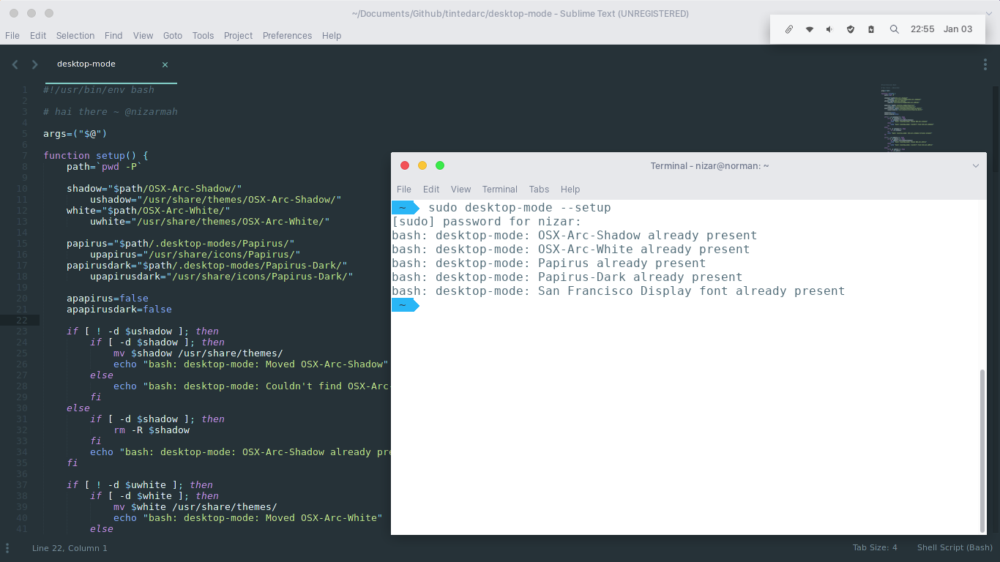
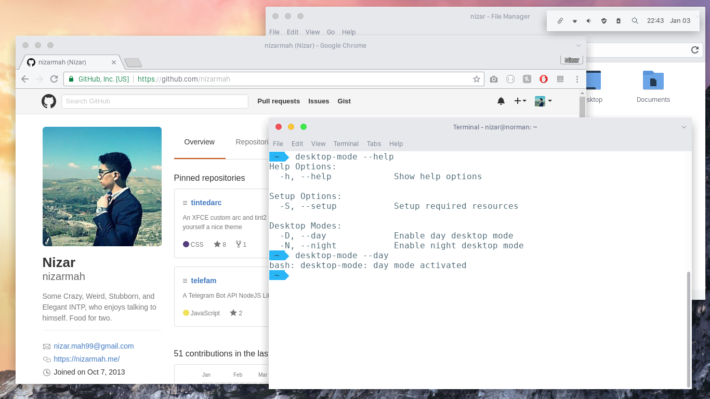
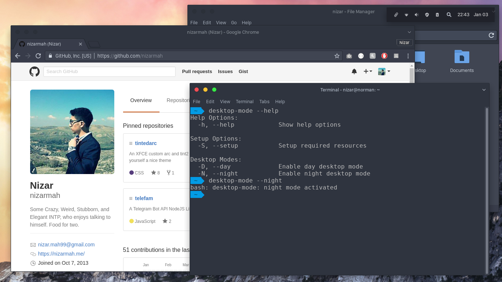

# tintedarc

> Bash Script is not compatible with anything other than XFCE.

I'm a freak that can't deal with linux unless it looks the way I want, so finally thought of sitting down and working on what I want.
Wallpaper is between the files by the way.

What it's consisted out of is :
 - [OSX Arc Shadow](https://aur.archlinux.org/packages/osx-arc-shadow/)
 - [OSX Arc White](https://aur.archlinux.org/packages/osx-arc-white/)
 - [Tint2 Panel](https://wiki.archlinux.org/index.php/tint2)
 - [Papirus Icon](https://aur.archlinux.org/packages/papirus/)
 - [San Francisco](https://github.com/AppleDesignResources/SanFranciscoFont)

However, the `osx-arc-shadow` is not left the way it is, but it's been tweaked.
Download the zip, and after extracting it, replace the `.xpm`s with the `.png`s in `/usr/share/themes/OSX-Arc-Shadow/xfwm4/`.

> Both Arc themes are uploaded since some users have had a hard time finding them
> Those Arc themes are not mine and I take no credit for it, I just tweaked the `xfwm4` folder ( everything except the merc )

Then close the xfce panel session and add tint2 to the startup applications.
After importing the tint2 theme, you should be good to go!

### Installation

All you need to do is download the repository.
Then, place the files and folders into `/home/$USER/bin/`. Accordingly, run `sudo desktop-mode --setup` and make sure that `OSX-Arc-Shadow` and `OSX-Arc-White` are in the same directory.
Then, the script should auto install the required resources.

Later on, if you care to use `rofi` or `tint2`, you can install them and upon installation, the script should automatically replace the configs with the script ones when run.

If you have `rofi` then go ahead and download the `.Xresources` and replace it with yours ( or the part which starts with rofi ).
After that make sure to type in terminal `xrdb ~/.Xresources`.
Later on, run `chmod +x ~/bin/desktop-mode` in terminal...
`desktop-mode --help` and you should be ready to go.

To enable the theme you wish, just type `--day` or `--night` instead of the help argument.

Enjoy :)

> If you can clean up my `desktop-mode` script please do. I'm just an amateur.

